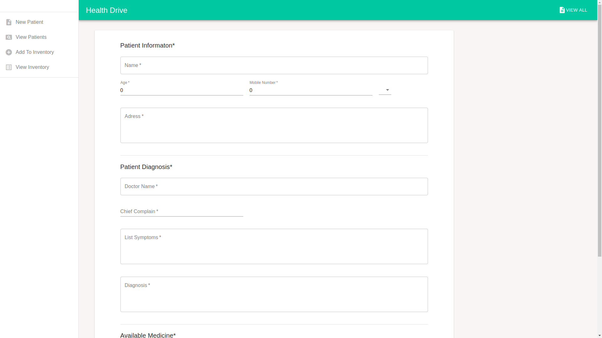
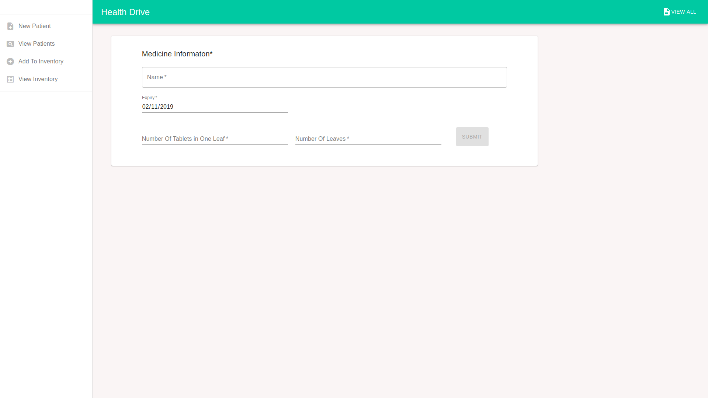
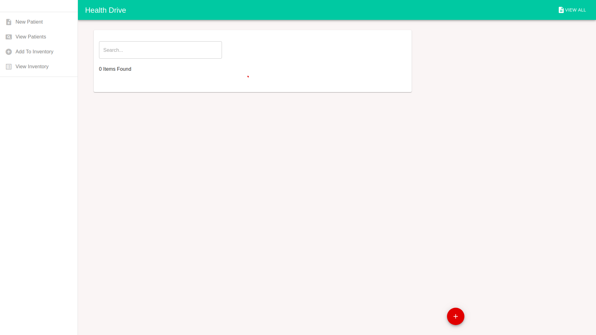

## About

Health-drive campaign are a common event wherein a community, mostly NGO's organise a health-camps in some remote areas. Various renowed doctors are invited to treat patients living in the remote areas who cannot afford costly treatments.

The NGO's require some medium to store the information about patients, doctors and inventory for making the drive a successfull one. HealthDrive is a web application designed to assis this noble deed. 
It is a web-application developed to store, update and manage the information about inventory and patients of healthdrive.

## Snapshots

## Techincal Aspect

This web application project is developed by @aryanmajor on [React JS](https://github.com/facebook/create-react-app).
The online live web application can be found at [this link](https://healthdrive.herokuapp.com/).
The live web application is not connected to database, hence the dynamicity is absent as of now.

## Available Scripts

In the project directory, you can run:

### `npm start`

Runs the app in the development mode. 
Open [http://localhost:3000](http://localhost:3000) to view it in the browser.

The page will reload if you make edits. 
You will also see any lint errors in the console.

### `npm test`

Launches the test runner in the interactive watch mode. 
See the section about [running tests](https://facebook.github.io/create-react-app/docs/running-tests) for more information.

### `npm run build`

Builds the app for production to the `build` folder. 
It correctly bundles React in production mode and optimizes the build for the best performance.

The build is minified and the filenames include the hashes. 

### `npm run eject`

**Note: this is a one-way operation. Once you `eject`, you can’t go back!**

If you aren’t satisfied with the build tool and configuration choices, you can `eject` at any time. This command will remove the single build dependency from your project.

Instead, it will copy all the configuration files and the transitive dependencies (Webpack, Babel, ESLint, etc) right into your project so you have full control over them. All of the commands except `eject` will still work, but they will point to the copied scripts so you can tweak them. At this point you’re on your own.

You don’t have to ever use `eject`. The curated feature set is suitable for small and middle deployments, and you shouldn’t feel obligated to use this feature. However we understand that this tool wouldn’t be useful if you couldn’t customize it when you are ready for it.

## Electron JS Application

The development of a standalone application is under process. This would be based on ElectronJS.
